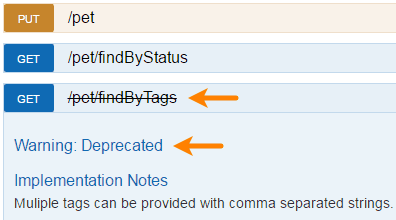

## 路径和操作(Paths and Operations)

在Swagger术语中， **paths** 是API公开的端点（资源），例如`/users`或`/reports/summary`和 **operations** 是用于操纵这些路径的HTTP方法，例如作为GET，POST或DELETE。

### 路径(Paths)

API路径和操作在API规范的全局`paths`部分中定义。

```
paths:
  /ping:
    ...
  /users:
    ...
  /users/{id}:
    ...
```

所有路径都与`basePath`相关（请参阅[API主机和基本URL](api-host-and-base-path.html)）。完整请求URL构造为`scheme://host/basePath/path`。

### 路径模板(Path Templating)

Swagger支持路径模板，这意味着可以使用花括号`{}`将URL的部分标记为 **路径参数**：

```
/users/{id}
/organizations/{orgId}/members/{memberId}
```

API客户端在进行API调用时需要提供适当的参数值，例如`/users/5`或`/users/12`。

### 操作(Operations)

对于每个路径，可以定义可用于访问该路径的操作（HTTP方法）。 Swagger 2.0支持`get`, `post`, `put`, `patch`, `delete`, `head`, 和 `options`。单个路径可以支持多个操作，例如`GET /users`来获取用户列表和`POST /users`来添加新用户，但是不允许为同一HTTP方法和路径执行多个操作。

最小例子：

```
paths:
  /ping:
    get:
      responses:
        200:
          description: OK
```

更详细的参数和响应模式示例：

```
paths:
  /users/{id}:
    get:
      summary: Gets a user by ID.
      description: >
        A detailed description of the operation.
        GitHub Flavored Markdown can be used for rich text representation,
        such as **bold**, *italic* and [links](http://swagger.io).
      operationId: getUsers
      tags:
        - users
      produces:
        - application/json
        - application/xml
      responses:
        200:
          description: OK
          schema:
            $ref: '#/definitions/User'
      externalDocs:
        url: http://api.example.com/docs/user-operations/
        description: Learn more about User operations provided by this API.
definitions:
  User:
    type: object
    properties:
      id:
        type: integer
      name:
        type: string
    required:
      - id
      - name
```

操作支持一些可选元素用于文档目的：

* 一个简短的 `summary` 和一个更长的`description`操作。 `description`可以是[多行](http://stackoverflow.com/questions/3790454/in-yaml-how-do-i-break-a-string-over-multiple-lines)，并支持[GitHub Flavored Markdown](https://guides.github.com/features/mastering-markdown/)用于富文本表示。

* `tags`用于在Swagger UI中对操作进行分组。

* `externalDocs'允许引用和包含其他文档的外部资源。

### 操作参数(Operation Parameters)

Swagger支持通过路径，查询字符串，头和请求体传递的操作参数。有关详细信息，请参阅[描述参数](parameters.html)。

### operationId

每个操作都可以指定一个唯一的“operationId”。一些代码生成器使用这个值来命名代码中的相应方法。

```
  /users:
     get:
       operationId: getUsers
       summary: Gets all users.
       ...
     post:
       operationId: addUser
       summary: Adds a new user.
       ...
   /user/{id}:
     get:
       operationId: getUserById
       summary: Gets a user by user ID.
       ...
```

### 路径查询字符串(Query String in Paths)

查询字符串参数 **不能** 包含在路径中。它们应该被定义为[query parameters](parameters.html#query-parameters)。

不正确的查询字符串：

```
paths:
  /users?role={role}:
```

正确的查询字符串：

```
paths:
  /users:
    get:
      parameters:
        - in: query
          name: role
          type: string
          enum: [user, poweruser, admin]
          required: false
```

这也意味着不可能有多个路径仅在查询字符串中有所不同，例如：

```
GET /users?firstName=value&lastName=value
GET /users?role=value
```

这是因为Swagger将唯一的操作视为路径和HTTP方法的组合，附加参数不会使操作唯一。相反，应该使用唯一的路径，如：

```
GET /users/findByName?firstName=value&lastName=value
GET /users/findByRole?role=value
```

### 标记为已弃用

可以将特定操作标记为`deprecated`，以表明它们应该被转换为使用用法：

```
  /pet/findByTags:
    get:
      deprecated: true
```

工具可以以特定的方式处理已弃用的操作。例如，Swagger UI以不同的样式显示它们：

